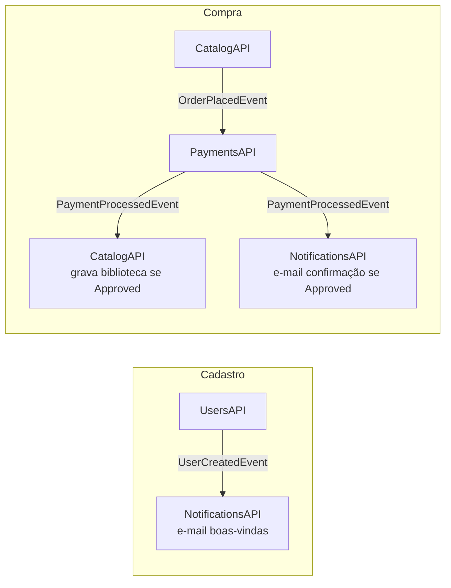

# FIAP Cloud Games (FCG) — Orquestração (Fase 2)

Repositório central de **orquestração** da plataforma FIAP Cloud Games, refatorada de um
monólito .NET para uma arquitetura de **microsserviços orientada a eventos**.

Aqui ficam o `docker-compose.yml` (sobe a plataforma completa localmente) e os manifestos
**Kubernetes** (`/k8s`) para o deploy em cluster. O código de cada microsserviço vive em
seu próprio repositório.

> **Grupo 16** — Org GitHub [`fcg-grupo-16`](https://github.com/fcg-grupo-16)

## Microsserviços

| Serviço | Repositório | Responsabilidade | Eventos |
|---|---|---|---|
| **UsersAPI** | [`users-api`](https://github.com/fcg-grupo-16/users-api) | Cadastro, autenticação (JWT) e autorização | publica `UserCreatedEvent` |
| **CatalogAPI** | [`catalog-api`](https://github.com/fcg-grupo-16/catalog-api) | CRUD de jogos, biblioteca e início da compra | publica `OrderPlacedEvent`; consome `PaymentProcessedEvent` |
| **PaymentsAPI** | [`payments-api`](https://github.com/fcg-grupo-16/payments-api) | Processa (simula) o pagamento | consome `OrderPlacedEvent`; publica `PaymentProcessedEvent` |
| **NotificationsAPI** | [`notifications-api`](https://github.com/fcg-grupo-16/notifications-api) | "Envia" e-mails (log no console) | consome `UserCreatedEvent` e `PaymentProcessedEvent` |

**Stack:** .NET 10 · MongoDB (database por serviço) · RabbitMQ + MassTransit · Docker · Kubernetes.

## Fluxos orientados a eventos



**Fluxo de cadastro:** `UsersAPI` cria o usuário e publica `UserCreatedEvent` → `NotificationsAPI` envia o e-mail de boas-vindas.

**Fluxo de compra:** `CatalogAPI` recebe a requisição de aquisição e publica `OrderPlacedEvent` (UserId, GameId, Price) → `PaymentsAPI` processa e publica `PaymentProcessedEvent` (Approved/Rejected) → `CatalogAPI` grava na biblioteca se aprovado, e `NotificationsAPI` envia o e-mail de confirmação.

## Estrutura de diretórios esperada

Clone os 5 repositórios como irmãos:

```
fiap/
├── orchestration/      (este repo)
├── users-api/
├── catalog-api/
├── payments-api/
└── notifications-api/
```

```bash
gh repo clone fcg-grupo-16/orchestration
gh repo clone fcg-grupo-16/users-api
gh repo clone fcg-grupo-16/catalog-api
gh repo clone fcg-grupo-16/payments-api
gh repo clone fcg-grupo-16/notifications-api
```

## Executar com Docker Compose

A partir deste repositório:

```bash
docker compose up --build
```

Sobe RabbitMQ, MongoDB e os 4 microsserviços. Portas expostas no host:

| Serviço | URL | Swagger |
|---|---|---|
| users-api | http://localhost:8081 | /swagger |
| catalog-api | http://localhost:8082 | /swagger |
| payments-api | http://localhost:8083 | (worker) |
| notifications-api | http://localhost:8084 | (worker) |
| RabbitMQ Management | http://localhost:15672 | guest / guest |
| MongoDB | mongodb://localhost:27017 | — |

> Swagger só é exposto em ambiente Development. Para ativá-lo no compose, troque
> `ASPNETCORE_ENVIRONMENT` para `Development` no serviço desejado.

### Testar os dois fluxos de ponta a ponta

```bash
./scripts/smoke-test.sh          # requer jq
docker compose logs payments-api notifications-api
```

Derrubar tudo:

```bash
docker compose down -v
```

## Deploy no Kubernetes (local)

Os manifestos estão em [`k8s/`](k8s/): `Namespace`, infra (`Deployment`+`Service` de
MongoDB e RabbitMQ) e, para cada microsserviço, `ConfigMap` (config não sensível),
`Secret` (connection strings, chave JWT, credenciais), `Deployment` e `Service`
(ClusterIP, porta 80 → 8080).

### Forma rápida (script)

```bash
./scripts/deploy-minikube.sh
```

Faz o build das imagens `:local`, carrega no minikube e aplica os manifestos.

### Forma manual

```bash
minikube start

# Build + carga das imagens no cluster
for s in users-api catalog-api payments-api notifications-api; do
  docker build -t "$s:local" "../$s"
  minikube image load "$s:local"
done

# Deploy (recursivo por causa das subpastas/ordenação)
kubectl apply -R -f k8s/

# Verificar
kubectl -n fcg get pods
```

Acessar os serviços:

```bash
kubectl -n fcg port-forward svc/users-api 8081:80
kubectl -n fcg port-forward svc/catalog-api 8082:80
kubectl -n fcg port-forward svc/rabbitmq 15672:15672   # Management UI
```

Comunicação interna no cluster usa os nomes de Service (ex.: `http://catalog-api:80`,
`rabbitmq:5672`, `mongodb:27017`).

Remover:

```bash
./scripts/undeploy-minikube.sh   # ou: kubectl delete -R -f k8s/
```

## Configuração e segredos

- **ConfigMaps** — dados não sensíveis: host do RabbitMQ, nome do database Mongo por
  serviço, issuer/audience do JWT, `ASPNETCORE_ENVIRONMENT`.
- **Secrets** — dados sensíveis: connection string do MongoDB, chave JWT e credenciais
  do RabbitMQ.
- A **chave JWT** (`JwtSettings__SecretKey`) **deve ser idêntica** em `users-api` (emite)
  e `catalog-api` (valida).
- Os valores aqui são de **demonstração**. Em produção, use segredos gerenciados
  (ex.: AWS Secrets Manager / Sealed Secrets) e nunca versione chaves reais.

## Credenciais semeadas (seed)

O `users-api` cria um administrador na inicialização:

- **E-mail:** `admin@fcg.com`
- **Senha:** `Admin@123456`

## Como contribuir

O fluxo vale para este repo e para os 4 repos de serviço:

1. **Pegue uma issue** no repositório correspondente e atribua a si mesmo (`assignee`).
2. **Crie um branch** a partir da `main`: `feat/<numero>-descricao-curta` ou `fix/<numero>-descricao-curta`.
3. **Commits** no padrão [Conventional Commits](https://www.conventionalcommits.org) (`feat:`, `fix:`, `chore:`, `test:`, `docs:`). Mensagens em pt-BR para domínio, inglês para termos técnicos.
4. **Abra um PR** para a `main` referenciando a issue (`Closes #<numero>`). O CI (build + testes) precisa passar.
5. **Merge** após review. Nunca commite segredos reais (use ConfigMaps/Secrets e variáveis de ambiente).

Política de idioma: conteúdo de usuário e domínio em **pt-BR**; namespaces, métodos e infraestrutura em **inglês**.

## Versionamento e release de imagens

Cada serviço versiona por **SemVer** via tag git `vX.Y.Z` no seu próprio repositório. Fluxo de release de uma versão:

```bash
# 1. No repo do serviço, com a main estável:
git tag v1.0.0 && git push origin v1.0.0

# 2. Build e publish da imagem no GitHub Container Registry (GHCR):
gh auth token | docker login ghcr.io -u <seu-usuario> --password-stdin
docker build -t ghcr.io/fcg-grupo-16/<servico>:v1.0.0 .
docker push ghcr.io/fcg-grupo-16/<servico>:v1.0.0

# 3. Atualize a imagem no cluster (neste repo, k8s/2x-<servico>.yaml, ou direto):
kubectl set image deploy/<servico> <servico>=ghcr.io/fcg-grupo-16/<servico>:v1.0.0 -n fcg
```

Para o desenvolvimento local com minikube continuamos usando a tag `:local` (build + `minikube image load`), como descrito acima. A pipeline de build/push para o GHCR em cada tag pode ser adicionada como workflow (`release.yml`) em cada repo — está mapeada como melhoria nas issues.

## Repositórios do grupo

- [orchestration](https://github.com/fcg-grupo-16/orchestration) · [users-api](https://github.com/fcg-grupo-16/users-api) · [catalog-api](https://github.com/fcg-grupo-16/catalog-api) · [payments-api](https://github.com/fcg-grupo-16/payments-api) · [notifications-api](https://github.com/fcg-grupo-16/notifications-api)
