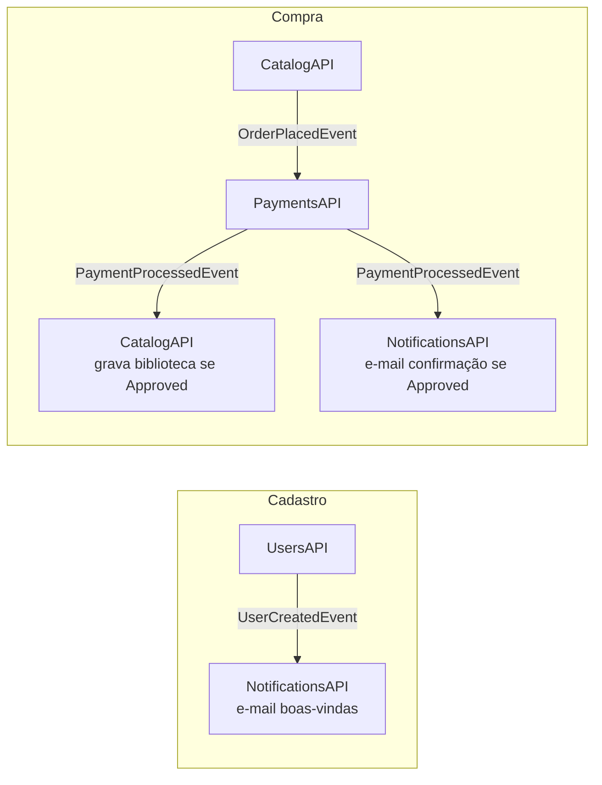

# FIAP Cloud Games (FCG) — Orquestração (Fase 2)

Repositório central de **orquestração** da plataforma FIAP Cloud Games, refatorada de um
monólito .NET para uma arquitetura de **microsserviços orientada a eventos**.

Aqui ficam o `docker-compose.yml` (sobe a plataforma completa localmente) e os manifestos
**Kubernetes** (`/k8s`) para o deploy em cluster. O código de cada microsserviço vive em
seu próprio repositório.

> **Grupo 16** — Org GitHub [`fcg-grupo-16`](https://github.com/fcg-grupo-16)

[](https://github.com/fcg-grupo-16/orchestration/actions/workflows/ci.yml)

## Microsserviços

| Serviço | Repositório | Responsabilidade | Eventos |
|---|---|---|---|
| **UsersAPI** | [`users-api`](https://github.com/fcg-grupo-16/users-api) | Cadastro, autenticação (JWT) e autorização | publica `UserCreatedEvent` |
| **CatalogAPI** | [`catalog-api`](https://github.com/fcg-grupo-16/catalog-api) | CRUD de jogos, biblioteca e início da compra | publica `OrderPlacedEvent`; consome `PaymentProcessedEvent` |
| **PaymentsAPI** | [`payments-api`](https://github.com/fcg-grupo-16/payments-api) | Processa (simula) o pagamento | consome `OrderPlacedEvent`; publica `PaymentProcessedEvent` |
| **NotificationsAPI** | [`notifications-api`](https://github.com/fcg-grupo-16/notifications-api) | "Envia" e-mails (log no console) | consome `UserCreatedEvent` e `PaymentProcessedEvent` |

**Stack:** .NET 10 · MongoDB (database por serviço) · **Redis** (cache distribuído) · RabbitMQ + MassTransit · **Prometheus + Grafana + Jaeger** (observabilidade) · Docker · Kubernetes.

> **RabbitMQ com plugin de mensagens atrasadas.** O broker roda uma imagem custom
> (`docker/rabbitmq/`: `rabbitmq:3.13.7-management` + `rabbitmq_delayed_message_exchange`),
> exigida pelo **delayed redelivery** (second-level retry) do MassTransit no
> [`catalog-api`](https://github.com/fcg-grupo-16/catalog-api) (issue `catalog-api#4`).
> O compose builda via `build:`; no k8s a imagem `fcg-rabbitmq:local` é construída e carregada
> no minikube pelo `scripts/deploy-minikube.sh`.

> **Topologia declarativa das filas de notificação (Fase 3).** A mesma imagem custom carrega
> [`docker/rabbitmq/definitions.json`](docker/rabbitmq/definitions.json) no boot (`load_definitions`),
> criando os exchanges, as filas `notifications-user-created` / `notifications-payment-processed`, a
> dead-letter queue `notifications-dlq` e o usuário `guest` — **sem depender de nenhum serviço .NET**.
> É pré-requisito da [`notifications-function`](https://github.com/fcg-grupo-16/notifications-function):
> o binding `RabbitMQTrigger` da Azure Functions só **consome** de uma fila existente, ele não declara
> nada. O raciocínio completo (por que o arquivo espelha exatamente o MassTransit, por que o
> dead-letter é por *policy* e não por argumento de fila, e por que o usuário `guest` precisa estar
> declarado) está em [`docker/rabbitmq/README.md`](docker/rabbitmq/README.md).
>
> ⚠️ Ao editar o `definitions.json`, **não** altere as propriedades dos exchanges
> (`fanout`/`durable`) nem acrescente `arguments` nas filas: elas participam da checagem de
> equivalência do `declare` do AMQP, e divergir quebra publishers e consumers com
> `PRECONDITION_FAILED`.

## Fluxos orientados a eventos


```mermaid
flowchart LR
    subgraph Cadastro
      U[UsersAPI] -- UserCreatedEvent --> N1[NotificationsAPI<br/>e-mail boas-vindas]
    end
    subgraph Compra
      C[CatalogAPI] -- OrderPlacedEvent --> P[PaymentsAPI]
      P -- PaymentProcessedEvent --> C2[CatalogAPI<br/>grava biblioteca se Approved]
      P -- PaymentProcessedEvent --> N2[NotificationsAPI<br/>e-mail confirmação se Approved]
    end
```

**Fluxo de cadastro:** `UsersAPI` cria o usuário e publica `UserCreatedEvent` → `NotificationsAPI` envia o e-mail de boas-vindas.

**Fluxo de compra:** `CatalogAPI` recebe a requisição de aquisição e publica `OrderPlacedEvent` (UserId, GameId, Price) → `PaymentsAPI` processa e publica `PaymentProcessedEvent` (Approved/Rejected) → `CatalogAPI` grava na biblioteca se aprovado, e `NotificationsAPI` envia o e-mail de confirmação.

## Estrutura de diretórios esperada

Clone os 5 repositórios como irmãos:

```
fiap/
├── orchestration/      (este repo)
├── users-api/
├── catalog-api/
├── payments-api/
└── notifications-api/
```

```bash
gh repo clone fcg-grupo-16/orchestration
gh repo clone fcg-grupo-16/users-api
gh repo clone fcg-grupo-16/catalog-api
gh repo clone fcg-grupo-16/payments-api
gh repo clone fcg-grupo-16/notifications-api
```

## Executar com Docker Compose

A partir deste repositório:

```bash
docker compose up --build
```

Sobe RabbitMQ, MongoDB e os 4 microsserviços. Portas expostas no host:

| Serviço | URL | Swagger |
|---|---|---|
| users-api | http://localhost:8081 | /swagger |
| catalog-api | http://localhost:8082 | /swagger |

> ⚠️ **O compose NÃO tem o API Gateway, e o contrato observável difere do cluster.** No compose os
> serviços são acessados direto nas portas acima, sem gateway: `GET /api/v1/jogos` responde **200
> anônimo** e não há rate limit. No Kubernetes o mesmo endpoint exige **token** (401 sem ele) e tem
> limite por IP. É decisão deliberada (decisão 3 do épico #24 — manter um `kong.yml` paralelo
> duplicaria a configuração do gateway), mas significa que **um cliente escrito contra o compose
> pode quebrar no cluster**. Ao desenvolver contra o compose, trate o token como obrigatório.
| payments-api | http://localhost:8083 | (worker) |
| notifications-api | http://localhost:8084 | (worker) |
| RabbitMQ Management | http://localhost:15672 | guest / guest |
| MongoDB | mongodb://localhost:27017/?replicaSet=rs0 | — |
| Redis | localhost:6379 | — |
| **Grafana** | http://localhost:3000 | admin / admin |
| **Prometheus** | http://localhost:9090 | — |
| **Jaeger** | http://localhost:16686 | — |

> Swagger só é exposto em ambiente Development. Para ativá-lo no compose, troque
> `ASPNETCORE_ENVIRONMENT` para `Development` no serviço desejado.

> **MongoDB roda como replica set (`rs0`).** O container sobe com `mongod --replSet rs0` e o
> healthcheck do compose **auto-inicia** o replica set (`rs.initiate(...)`); por isso os serviços
> conectam com `MongoDbSettings__ConnectionString=mongodb://mongodb:27017/?replicaSet=rs0`. O replica
> set é **pré-requisito do outbox transacional da `users-api`** — transações multi-documento do
> MongoDB exigem replica set. Ao editar o `docker-compose.yml`, **não** remova o `--replSet rs0` nem
> o `?replicaSet=rs0` das connection strings, ou o cadastro de usuários passa a falhar.

### Testar os dois fluxos de ponta a ponta

```bash
./scripts/smoke-test.sh          # requer jq
docker compose logs payments-api notifications-api
```

Derrubar tudo:

```bash
docker compose down -v
```

## Deploy no Kubernetes (local)

Os manifestos estão em [`k8s/`](k8s/): `Namespace`, infra (`StatefulSet`+`Service` do
MongoDB, `Deployment`+`Service` do RabbitMQ) e, para cada microsserviço, `ConfigMap`
(config não sensível), `Secret` (connection strings, chave JWT, credenciais),
`Deployment` e `Service` (ClusterIP, porta 80 → 8080).

> **Persistência do MongoDB.** O Mongo roda como `StatefulSet` com `volumeClaimTemplates`,
> que provisiona um `PersistentVolumeClaim` (`mongo-data-mongodb-0`, `storageClassName: standard`
> — a StorageClass padrão do minikube). O volume **sobrevive** à recriação do Pod (rollout,
> `kubectl delete pod`, reagendamento), então `usersdb`/`catalogdb` não são perdidos. O Service
> `mongodb` (headless, porta 27017) mantém o mesmo DNS interno, então as APIs seguem conectando por
> `mongodb://mongodb:27017/?replicaSet=rs0` sem mudança de config. Confira o PVC com
> `kubectl -n fcg get pvc` (STATUS `Bound`).
>
> **Replica set `rs0` (paridade com o compose).** Assim como no `docker-compose.yml`, o Mongo no
> k8s roda como **single-node replica set** — o container sobe com `mongod --replSet rs0` e a
> `readinessProbe` inicia o RS de forma idempotente (mesmo `rs.initiate(...)` do healthcheck do
> compose), só marcando o Pod `Ready` após o RS estar de pé. As connection strings dos Secrets de
> `users-api` e `catalog-api` usam `?replicaSet=rs0`. Isso é **exigido pelo outbox transacional**
> (transações multi-documento do Mongo requerem replica set), então o fluxo de cadastro funciona no
> cluster igual ao compose. Confira com `kubectl -n fcg exec mongodb-0 -- mongosh --quiet --eval 'rs.status().ok'`.

### Forma rápida (script)

```bash
./scripts/deploy-minikube.sh
```

Faz o build das imagens `:local`, carrega no minikube e aplica os manifestos.

### Forma manual

```bash
minikube start

# Build + carga das imagens no cluster
for s in users-api catalog-api payments-api notifications-api; do
  docker build -t "$s:local" "../$s"
  minikube image load "$s:local"
done

# Deploy (recursivo por causa das subpastas/ordenação)
kubectl apply -R -f k8s/

# Verificar
kubectl -n fcg get pods
```

Acessar os serviços:

```bash
kubectl -n fcg port-forward svc/users-api 8081:80
kubectl -n fcg port-forward svc/catalog-api 8082:80
kubectl -n fcg port-forward svc/rabbitmq 15672:15672   # Management UI
```

Comunicação interna no cluster usa os nomes de Service (ex.: `http://catalog-api:80`,
`rabbitmq:5672`, `mongodb:27017`).

### Acesso externo: API Gateway (Kong) — porta de entrada única

Todo o tráfego externo entra pelo **Kong Ingress Controller** em modo **DB-less**, com um host
único `api.fcg.local`. O gateway **valida o JWT na borda**: sem token válido a requisição recebe
401 e **não sai do namespace `kong`**. Os serviços continuam validando por conta própria — a borda
antecipa a rejeição, não substitui a autorização do serviço.

O Ingress NGINX anterior (dois hosts, sem validação de token) foi **removido**.

```
                        ┌──────────────────────────────────────────┐
   cliente ──────────►  │  Kong (namespace kong) — api.fcg.local   │
                        └──────┬───────────────────────────┬───────┘
                     PÚBLICAS │                           │ PROTEGIDAS (jwt + rate-limit)
                              ▼                           ▼
   POST /api/v1/auth/**  → users-api:80     GET/PUT/DELETE /api/v1/usuarios/** → users-api:80
   POST /api/v1/usuarios → users-api:80     /api/v1/jogos/**                   → catalog-api:80
                                            /api/v1/biblioteca/**              → catalog-api:80
                                            /api/v1/pedidos/**                 → catalog-api:80
                                            /api/v1/avaliacoes/**              → catalog-api:80
```

**Público sem token:** `login`, `refresh` e o **cadastro** (`POST /api/v1/usuarios`) — são como o
usuário *obtém* um token; exigir token aqui seria um deadlock. O cadastro tem rota própria
(`pathType: Exact` + `konghq.com/methods: POST`), então `GET /api/v1/usuarios` sem token dá 401.

**Fora do gateway de propósito:** `payments-api` e `notifications-function` são orientados a
eventos e não têm rota. `/health*` e `/metrics` também não — o Prometheus raspa os pods **dentro**
do cluster.

> ⚠️ **`GET /api/v1/jogos` é `[AllowAnonymous]` no `catalog-api`, mas a BORDA exige token.**
> Decisão consciente: evita rota ambígua por método no mesmo path (fonte clássica de bug de
> prioridade no Kong) e deixa a demonstração inequívoca — sem token 401, com token 200. Os
> `[AllowAnonymous]` continuam no código, então acesso interno (pod-a-pod, Prometheus, testes de
> integração) não muda.

#### Configuração versionada

| Arquivo | Papel |
| --- | --- |
| [`gateway/kong-values.yaml`](gateway/kong-values.yaml) | values do chart (DB-less, `ingressClass: kong`, proxy NodePort 30080, admin/manager/portal fechados) |
| [`k8s/gateway/40-kong-consumer.yaml`](k8s/gateway/40-kong-consumer.yaml) | `KongConsumer` + credencial JWT |
| [`k8s/gateway/41-kong-plugins.yaml`](k8s/gateway/41-kong-plugins.yaml) | plugins `jwt`, `rate-limiting` (120/min protegido e 20/min público — ver a limitação abaixo), `correlation-id` |
| [`k8s/gateway/42-kong-ingress.yaml`](k8s/gateway/42-kong-ingress.yaml) | as três rotas (pública, cadastro, protegida) |

> **Por que o `kong-values.yaml` não está em `k8s/gateway/`:** o `deploy-minikube.sh` roda
> `kubectl apply -R -f k8s/`, e um values de Helm não tem `apiVersion`/`kind` — o apply falharia
> **inteiro**. Artefato que não é manifesto vive fora de `k8s/`.

A instalação é por **Helm** (pré-requisito novo), com a versão do chart **pinada**; o
`deploy-minikube.sh` faz isso automaticamente, **antes** do `kubectl apply`, porque os CRDs
`KongPlugin`/`KongConsumer` são pré-requisito dos manifestos:

```bash
brew install helm                       # pré-requisito
./scripts/deploy-minikube.sh            # instala o Kong (chart 3.4.1) e aplica tudo
```

#### Acessar e testar

```bash
kubectl -n kong port-forward svc/kong-kong-proxy 8000:80
GW=http://localhost:8000; H='Host: api.fcg.local'
```

| Comando | Esperado |
| --- | --- |
| `curl -i -H "$H" $GW/api/v1/jogos` | **401** com `Server: kong/3.9.3` — é o **Kong**, não o serviço |
| `curl -i -H "$H" -H 'Authorization: Bearer lixo' $GW/api/v1/jogos` | **401** |
| `curl -H "$H" -H 'Content-Type: application/json' -d '{"email":"admin@fcg.com","senha":"Admin@123456"}' $GW/api/v1/auth/login` | **200** + token (campo `.token`) |
| `curl -i -H "$H" -H "Authorization: Bearer $TOKEN" $GW/api/v1/jogos` | **200** |
| `curl -i -H "$H" -H 'Content-Type: application/json' --data-binary @signup.json $GW/api/v1/usuarios` | **201** (cadastro público) |
| `curl -i -H "$H" $GW/api/v1/usuarios` | **401** (GET exige token) |
| `curl -i -H "$H" -H "Authorization: Bearer $TOKEN" $GW/health` | **404** — não exposto |
| 130 requisições em 1 min | aparece **429** após 120 — **não** prova isolamento (ver limitação) |
| `./scripts/gateway-test.sh` | a matriz inteira, incluindo o teste de **dois pods** do rate limit |
| `curl -si ... \| grep -i ratelimit` | `RateLimit-Limit: 120`, `RateLimit-Remaining`, `RateLimit-Reset` |

> **macOS + driver docker:** o `minikube ip` não é alcançável direto do host, por isso o
> `port-forward` acima é o caminho recomendado em vez de `/etc/hosts` + `minikube tunnel`.

> ⚠️ **A `IngressClass` default do cluster continua sendo a `nginx`**
> (`ingressclass.kubernetes.io/is-default-class: true`), com o controller do minikube instalado.
> Nada da plataforma passa por ele hoje — todos os nossos Ingress declaram
> `ingressClassName: kong` —, mas **um Ingress futuro que esqueça o `ingressClassName` entra pelo
> NGINX, sem validação de JWT**, furando a porta de entrada única. Ao adicionar rota nova, declare
> a classe explicitamente.

#### Correlation-id — o que ele faz e o que não faz

O plugin gera um `X-Correlation-Id` por requisição, propaga ao upstream e devolve ao cliente
(`echo_downstream`). O `CorrelationIdMiddleware` dos serviços lê o header e o coloca em
`HttpContext.TraceIdentifier`.

> ⚠️ **O id NÃO entra nos logs dos serviços.** Verificado no cluster: `kubectl logs deploy/users-api`
> tem zero ocorrências de correlation — o middleware não empurra o valor para o `LogContext` do
> Serilog. Para rastrear ponta a ponta hoje, use o **TraceId** (`@tr` no log estruturado, mesmo id
> no Jaeger). Enriquecer o log com o correlation-id é melhoria dos serviços, não do gateway.

#### Limitações conhecidas

- O Deployment do Kong vem do chart **sem `resources`** definidos por nós, ao contrário dos
  serviços do `fcg`, que têm requests/limits.
- Sem TLS no gateway (ambiente de demonstração).
- `rate-limiting` com `policy: local`: exato com 1 réplica do Kong; com N réplicas o limite
  efetivo seria N × 120. Contador global exigiria `policy: redis`.
- ⚠️ **O rate limit é, na prática, um bucket GLOBAL para todo cliente externo.** Não é o que o
  nome `limit_by: ip` sugere, e não foi corrigido — é limitação conhecida. Medido no cluster:
  via `kubectl port-forward` (o único caminho documentado) o access log do Kong registra
  `127.0.0.1` para **todas** as requisições; via NodePort 30080 o Service tem
  `externalTrafficPolicy: Cluster`, então o kube-proxy faz SNAT e todo cliente externo chega com o
  IP do nó. E o contador é compartilhado entre as 5 rotas protegidas (medido em sequência:
  `jogos`=116 → `biblioteca`=115 → `pedidos`=114 → `jogos`=113 → `avaliacoes`=112).
  **São 120/min para a plataforma inteira vista de fora**, e um cliente que esgote a cota faz os
  outros receberem 429. Passaria a isolar de verdade com um LoadBalancer real preservando o IP de
  origem (`externalTrafficPolicy: Local`) ou `trusted_ips`/`real_ip_header` configurados **no
  Kong** — nenhum dos dois existe aqui.
- Ainda assim `limit_by: ip` é preferível a `consumer`: com `consumer` o colapso é **garantido por
  construção**, porque todo JWT do `users-api` tem `iss: FiapCloudGames` e o plugin resolve o
  consumer por essa claim — todos casam com o único `KongConsumer`. Limite real por usuário exigiria
  um `KongConsumer` por usuário, o que não é declarável para usuários dinâmicos.
- ⚠️ **O `ForwardedHeaders__*` dos serviços não ajuda nisso.** Ele governa o `RemoteIpAddress` que
  `users-api`/`catalog-api` leem do `X-Forwarded-For` escrito pelo Kong — e esse valor é
  `127.0.0.1` para todos. Logo o rate limiter de login do próprio `users-api` também é global hoje.
- ⚠️ **Requisição não autenticada não consome cota nas rotas protegidas.** O plugin `jwt`
  (prioridade 1005) roda antes do `rate-limiting` (901) e encerra a requisição: medido, o 401 sai
  com **0** headers `RateLimit-*` e o 200 com 3. Um flood anônimo com token inválido nas rotas
  protegidas não é limitado na borda. Prioridade de plugin no Kong é fixa por tipo — não há inversão
  declarativa. O caminho anônimo é coberto pelo `fcg-rate-limit-publico` nas rotas públicas.
- A credencial JWT é um `Secret` com o valor **em claro** — de demonstração, como já ocorre no
  `docker-compose.yml`. Migrar para SealedSecret é follow-up.

Remover:

```bash
./scripts/undeploy-minikube.sh
```

> O script remove os manifestos **e** o gateway (release Helm, namespace `kong` e os CRDs
> `*.konghq.com`), nessa ordem — os CRDs têm de sair **depois** dos `KongPlugin`/`KongConsumer`,
> senão o delete falha com `no matches for kind KongPlugin`. Um `kubectl delete -R -f k8s/` avulso
> **não** desinstala o Kong: deixaria o release, os CRDs, o webhook de admissão e a NodePort 30080
> para trás.

> O `PersistentVolumeClaim` gerado pelo `volumeClaimTemplates` **não** é removido por
> `kubectl delete -R -f k8s/` — os dados ficam para trás de propósito. Para zerar de vez
> num ambiente de demo: `kubectl -n fcg delete pvc mongo-data-mongodb-0`.

## Observabilidade — escolhemos a **Opção A** (Prometheus + Grafana)

O desafio da Fase 3 pede para escolher entre uma stack de código aberto (**Opção A**: Prometheus +
Grafana) ou uma plataforma de APM gerenciada (**Opção B**: Datadog ou New Relic), e **documentar a
escolha aqui**. Optamos pela **Opção A**, por três motivos:

1. **Custo zero e sem dependência de terceiros.** Nenhuma conta, nenhum trial que expira antes da
   entrega, nenhuma chave de API para gerenciar.
2. **É o que o próprio enunciado exige para a Opção A:** *"a implantação das ferramentas deve ser
   feita via manifestos Kubernetes"* — tudo está em [`k8s/40-`](k8s/40-observability-prometheus.yaml),
   [`41-`](k8s/41-observability-grafana.yaml), [`41b-`](k8s/41b-grafana-dashboard.yaml) e
   [`42-`](k8s/42-observability-jaeger.yaml), versionado e reproduzível.
3. **Funciona offline**, o que importa no dia da gravação do vídeo.

### Os três componentes

| Componente | Papel | Acesso |
|---|---|---|
| **Prometheus** | raspa `/metrics` dos pods e armazena as séries (retenção 6h) | `kubectl -n fcg port-forward svc/prometheus 9090:9090` |
| **Grafana** | dashboard de latência, throughput e erros | `kubectl -n fcg port-forward svc/grafana 3000:3000` — admin/admin |
| **Jaeger** | recebe traces OTLP e mostra o trace distribuído | `kubectl -n fcg port-forward svc/jaeger 16686:16686` |

> **Por que Jaeger, se a Opção A só exige métricas?** O MassTransit 8 propaga contexto de trace W3C
> nativamente entre publisher e consumer. Com o exportador OTLP ligado nos serviços, o trace do
> fluxo **"Compra de Jogo"** atravessa `catalog-api → RabbitMQ → payments-api → RabbitMQ →
> catalog-api` sem código adicional. Cobrir o terceiro pilar da observabilidade sai quase de graça,
> e é entregável que o desafio só pede na Opção B.

### Como os serviços são descobertos

No **Kubernetes**, por *annotation de pod* — um serviço novo que suba com elas é raspado sem editar
config nenhuma:

```yaml
      annotations:
        prometheus.io/scrape: "true"
        prometheus.io/port: "8080"
        prometheus.io/path: "/metrics"
```

No **compose** não existe API de pods para consultar, então os targets são estáticos em
[`docker/prometheus/prometheus.yml`](docker/prometheus/prometheus.yml). Nos dois casos as séries
recebem o label **`service`**, e é isso que faz o **mesmo dashboard** funcionar nos dois ambientes.

### O dashboard

A fonte da verdade é [`observability/fcg-overview.json`](observability/fcg-overview.json),
versionado. O ConfigMap `k8s/41b-grafana-dashboard.yaml` é **derivado** dele:

```bash
./scripts/gen-dashboard-configmap.sh    # regenera o ConfigMap a partir do JSON
```

As quatro métricas exigidas pela Fase 3 vêm **todas do mesmo histograma**
`http_server_request_duration_seconds` — **nenhuma métrica customizada foi necessária**.

Sendo preciso: o ASP.NET Core 8+ já instrumenta o `Meter` `Microsoft.AspNetCore.Hosting` com o
instrumento `http.server.request.duration` por conta própria; o **nome no formato Prometheus** e o
endpoint `/metrics` só passam a existir quando o serviço adiciona o SDK OpenTelemetry com
`AddPrometheusExporter()` + `MapPrometheusScrapingEndpoint()` — que é justamente o escopo de
`users-api#19`, `catalog-api#19` e `payments-api#19`. Os labels usados nas queries
(`http_response_status_code`, `http_request_method`, `http_route`) são os da convenção semântica
estável do OpenTelemetry.

> **Nota sobre o `or vector(0)` na taxa de erro.** Sem nenhum 5xx, a série filtrada **não existe**
> no Prometheus, e vetor vazio dividido por qualquer coisa continua vazio — sem esse guarda, o
> painel mostraria `No data` justamente quando a plataforma está saudável, visualmente idêntico a
> "a stack quebrou". O `clamp_min` no denominador resolve outro problema (o `NaN` de 0/0 quando o
> tráfego cessa); os dois são necessários.


| Painel | Métrica exigida | PromQL |
|---|---|---|
| Latência p50/p95/p99 por serviço | **latência** | `histogram_quantile(0.95, sum by (le, service) (rate(..._bucket[5m])))` |
| Throughput por serviço | **contagem de requisições** | `sum by (service) (rate(..._count[5m]))` |
| Requisições por status code | **contagem por status HTTP** | `sum by (http_response_status_code) (rate(..._count[5m]))` |
| Taxa de erro 5xx | **taxa de erros** | `100 * (sum(rate(..._count{...5xx}[5m])) or vector(0)) / clamp_min(sum(rate(..._count[5m])), 0.001)` |

> ⚠️ **Os painéis ficam vazios até a instrumentação dos serviços entrar.** Este repositório entrega
> a stack e o contrato de coleta; o endpoint `/metrics` nasce em `users-api#19`, `catalog-api#19` e
> `payments-api#19`. Até lá o Prometheus **descobre** os três pods e os mostra como `DOWN` com
> `404 Not Found` em `/metrics` — o que é o comportamento correto e a prova de que a descoberta e a
> rede estão certas. Acompanhe em **Status → Targets** no Prometheus, ou pelo painel *Saúde da
> coleta* do próprio dashboard.
>
> ⚠️ **Ao instrumentar, confirme o nome real da métrica** no autocomplete do Prometheus: dependendo
> da versão do exportador ela pode sair como `http_server_request_duration_seconds` ou
> `http_server_duration_seconds`. **9 dos 10 painéis dependem desse nome** (a variável `service`
> inclusive), então uma divergência esvazia o dashboard inteiro de uma vez. Se acontecer:
>
> ```bash
> # 1. veja o nome real
> curl -s localhost:8081/metrics | grep -m1 '^# TYPE.*duration'
> # 2. troque em todas as queries
> sed -i '' 's/http_server_request_duration_seconds/<nome-real>/g' observability/fcg-overview.json
> # 3. regenere o ConfigMap e reaplique
> ./scripts/gen-dashboard-configmap.sh && kubectl apply -f k8s/41b-grafana-dashboard.yaml
> ```
>
> Não é preciso reiniciar o Grafana: o provider relê o diretório a cada 10s (a mudança aparece em
> ~20s). Só os **datasources** exigem `rollout restart`.

```bash
# Verificar a coleta
kubectl -n fcg port-forward svc/prometheus 9090:9090
open http://localhost:9090/targets

# Abrir o dashboard
kubectl -n fcg port-forward svc/grafana 3000:3000
open http://localhost:3000        # admin/admin -> pasta FCG -> "FCG — Visão Geral"
```

> **Portas 9090, 3000 e 4317 ocupadas?** São portas muito disputadas (outra stack de observabilidade
> na máquina, por exemplo). No compose elas são publicadas apenas em `127.0.0.1`; para remapear, use
> o `docker-compose.override.yml` (gitignored), nunca o arquivo versionado:
>
> ```yaml
> services:
>   prometheus:
>     ports: !override
>       - "127.0.0.1:9091:9090"
>   jaeger:
>     ports: !override
>       - "127.0.0.1:16686:16686"
>       - "127.0.0.1:4327:4317"
>       - "127.0.0.1:4328:4318"
> ```
>
> ⚠️ E **confirme a identidade** do que responde antes de concluir que a stack subiu — um
> `curl localhost:9090` pode estar batendo no Prometheus de outro projeto:
> `curl -s localhost:9090/api/v1/status/config | grep cluster` deve mostrar `fcg-compose`
> (ou `fcg-minikube` no cluster).

## Cache distribuído (Redis)

A plataforma provisiona um **Redis** como camada de cache distribuído (Fase 3). O consumo pelo
código dos serviços vem nas issues seguintes: `users-api#20` e `catalog-api#21` (cache de consultas
onerosas) e `notifications-function#3` (store de idempotência). Este repositório entrega a
infraestrutura e o contrato de configuração.

| | |
|---|---|
| Compose | serviço `redis`, porta `6379` |
| Kubernetes | [`k8s/12-infra-redis.yaml`](k8s/12-infra-redis.yaml) — `Deployment` + `Service` ClusterIP |
| Config | `Redis__InstanceName` no ConfigMap (não sensível) · `Redis__ConnectionString` no SealedSecret |

**Isolamento entre serviços é lógico, por prefixo de chave.** Uma instância de Redis atende toda a
plataforma; cada serviço escreve sob um prefixo próprio, definido em `Redis__InstanceName`:
`fcg:users:` e `fcg:catalog:` (provisionados aqui) e `fcg:notifications:` (convenção reservada
para a `notifications-function`, cujo ConfigMap nasce em `notifications-function#5`). Evita subir
três instâncias num ambiente de demonstração.

> ⚠️ **Prefixo é organização, não fronteira de segurança.** O Redis roda sem autenticação e sem
> `NetworkPolicy`, então qualquer pod do namespace consegue ler e escrever o keyspace de qualquer
> serviço — um `KEYS fcg:users:*` a partir do `payments-api` funciona. Diferente do
> *database-per-service* do Mongo, isto não é uma barreira: é uma convenção de nomes. Aceitável
> num ambiente de demonstração; em produção exigiria `requirepass`/ACL por serviço e NetworkPolicy
> de ingress.

**Sem persistência, de propósito.** O Redis sobe com `--save ""` e `--appendonly no`, e no
Kubernetes é um `Deployment` **sem** `PersistentVolumeClaim` — ao contrário do MongoDB, que é
`StatefulSet` com volume. Todo dado aqui é reconstruível a partir do Mongo, então perdê-lo na
recriação do Pod é aceitável e evita carregar um PVC que não agregaria nada.

**Proteção contra OOM.** `--maxmemory 256mb` com `--maxmemory-policy allkeys-lru`: ao atingir o
teto, o Redis descarta as chaves menos usadas em vez de crescer até estourar. O `limits.memory` do
container é **o dobro** desse teto (512Mi) justamente para o kernel não matar o container antes de
a evicção rodar — o `maxmemory` do Redis contabiliza o allocator, não o RSS, então fragmentação e
buffers de saída de cliente ficam fora daquela conta e entram na do kernel.

```bash
# compose
docker compose exec redis redis-cli ping
docker compose exec redis redis-cli --scan --pattern 'fcg:*'

# kubernetes
kubectl -n fcg exec deploy/redis -- redis-cli ping
kubectl -n fcg exec deploy/redis -- redis-cli --scan --pattern 'fcg:*'
```

> **Porta 6379 ocupada na sua máquina?** É comum ter outro Redis local. Remapeie **apenas** no
> `docker-compose.override.yml` (gitignored), como já fazemos com o Mongo em `27018` — nunca no
> `docker-compose.yml` versionado:
>
> ```yaml
> services:
>   redis:
>     ports: !override
>       - "6380:6379"
> ```
>
> Os serviços do compose continuam falando com `redis:6379` pela rede interna do docker; o
> remapeamento afeta só o acesso a partir do host.

## Configuração e segredos

- **ConfigMaps** — dados não sensíveis: host do RabbitMQ, nome do database Mongo por
  serviço, issuer/audience do JWT, `ASPNETCORE_ENVIRONMENT`.
- **Secrets** — dados sensíveis: connection string do MongoDB, chave JWT, credenciais
  do RabbitMQ e a connection string do Redis (`Redis__ConnectionString`).
- **Cache (Fase 3):** `Redis__InstanceName` vai no **ConfigMap** de cada serviço (é só um prefixo
  de chave, não sensível); `Redis__ConnectionString` vai no **Secret**, por paridade com as demais
  connection strings — em produção ela carregaria credencial.
- A **chave JWT** (`JwtSettings__SecretKey`) **deve ser idêntica** em `users-api` (emite)
  e `catalog-api` (valida).
- **Databases (database-per-service):** `usersdb` (users-api), `catalogdb` (catalog-api) e
  `paymentsdb` (payments-api). O `paymentsdb` é provisionado aqui (ConfigMap + SealedSecret com
  `?replicaSet=rs0`) e passa a ser consumido pela persistência/idempotência do payments-api
  (issues `payments-api#2`/`#1`). Todos reusam a mesma instância `mongodb` (databases lógicos distintos).
- Os valores são de **demonstração**. NUNCA versione chaves reais.

### Segredos no Kubernetes — Sealed Secrets

No **Kubernetes**, os Secrets **não** são versionados em texto claro. Em vez disso, o repo
versiona **`SealedSecret`s cifrados** ([`k8s/05-sealed-secrets.yaml`](k8s/05-sealed-secrets.yaml)),
usando [Bitnami Sealed Secrets](https://github.com/bitnami-labs/sealed-secrets). Apenas o
**controller do cluster** consegue decifrá-los e materializar os `Secret` reais no namespace `fcg`;
o arquivo cifrado é seguro para commit.

> No `docker-compose` (dev local) os segredos continuam em variáveis de ambiente/âncora YAML —
> Sealed Secrets é um mecanismo **específico de Kubernetes**. Os **valores** são idênticos entre
> compose e k8s; só a forma de armazenamento no cluster muda.

**Pré-requisitos (uma vez por cluster):**

```bash
# 1) CLI kubeseal
brew install kubeseal

# 2) controller no cluster (versão pinada; o deploy-minikube.sh também garante isso)
kubectl apply -f https://github.com/bitnami-labs/sealed-secrets/releases/download/v0.38.4/controller.yaml
kubectl -n kube-system rollout status deploy/sealed-secrets-controller
```

**Gerar / rotacionar os segredos** — edite os valores (ou exporte as env vars para valores reais)
e rode o helper, que regenera o arquivo cifrado:

```bash
# valores de demo por padrão; para valores reais: export JWT_SECRET_KEY=... RABBIT_PASS=... etc.
./scripts/seal-secrets.sh
kubectl apply -f k8s/05-sealed-secrets.yaml   # o controller materializa os Secrets
```

O `scripts/seal-secrets.sh` garante que `JwtSettings__SecretKey` seja **idêntica** em
`users-api-secret` e `catalog-api-secret` (JWT parity).

> ⚠️ **A chave do controller é por-cluster.** Se recriar o minikube (`minikube delete`), o novo
> controller ganha outra chave e os `SealedSecret`s antigos **não decifram mais** — reinstale o
> controller e rode `./scripts/seal-secrets.sh` de novo. Em produção, faça backup da chave do controller.

## Credenciais semeadas (seed)

O `users-api` cria um administrador na inicialização:

- **E-mail:** `admin@fcg.com`
- **Senha:** `Admin@123456`

## CI — validação de compose e manifestos

Todo **push na `main`** e **todo pull request** dispara o workflow
[`.github/workflows/ci.yml`](.github/workflows/ci.yml), que valida a orquestração
**sem subir nada** (não há cluster nem build de imagem no CI):

| Step | Comando | O que pega |
|---|---|---|
| docker-compose | `docker compose -f docker-compose.yml config -q` | sintaxe/estrutura do compose |
| kubeconform | `kubeconform -strict -ignore-missing-schemas k8s/` | schema rigoroso dos manifestos (offline) — **mas ver a ressalva abaixo sobre os CRDs do Kong** |
| yamllint | `yamllint -d relaxed …` | estilo de YAML (**não-bloqueante** por enquanto) |

> **Por que kubeconform e não `kubectl --dry-run=client`?** Apesar do nome, o dry-run
> "client" do kubectl moderno **não é offline**: ele precisa de _discovery_ do apiserver
> e do OpenAPI do cluster para validar — sem cluster no runner, falha com
> `connection refused`. O `kubeconform` faz a **mesma validação de schema, offline** e
> mais rigorosa, contra os schemas oficiais do Kubernetes.
>
> O CI usa apenas `-f docker-compose.yml` para ser **determinístico**: valida só o
> arquivo versionado, sem influência de um `docker-compose.override.yml` local
> (gitignored) — o Compose só o carrega automaticamente se ele existir. O `kubeconform`
> roda em versão **pinada** (nunca `latest`) e o `-ignore-missing-schemas` evita
> falso-negativo em CRDs sem schema conhecido — é o caso do `SealedSecret`
> (`k8s/05-sealed-secrets.yaml`), que o kubeconform **pula** em vez de reprovar.
>
> ⚠️ **O mesmo vale para os CRDs do Kong, e a consequência é maior.** `KongPlugin` e
> `KongConsumer` (`k8s/gateway/`) são **pulados**: dos 47 recursos, 11 são skipped e só o Secret e
> os 3 Ingresses de `k8s/gateway/` chegam a ser validados. Um campo inexistente ou um typo em
> `claims_to_verify` passa **verde no CI** — e o modo de falha é traiçoeiro: o Kong rejeita o
> plugin, o gateway devolve 401 sem token (parece funcionar) e devolve 401 **também com token
> válido**. A validação real do gateway é o `scripts/gateway-test.sh`, contra um cluster.

Para reproduzir o CI localmente:

```bash
docker compose -f docker-compose.yml config -q             # step 1
kubeconform -strict -summary -ignore-missing-schemas k8s/  # step 2 (brew install kubeconform)
```

## Como contribuir

O fluxo vale para este repo e para os 4 repos de serviço:

1. **Pegue uma issue** no repositório correspondente e atribua a si mesmo (`assignee`).
2. **Crie um branch** a partir da `main`: `feat/<numero>-descricao-curta` ou `fix/<numero>-descricao-curta`.
3. **Commits** no padrão [Conventional Commits](https://www.conventionalcommits.org) (`feat:`, `fix:`, `chore:`, `test:`, `docs:`). Mensagens em pt-BR para domínio, inglês para termos técnicos.
4. **Abra um PR** para a `main` referenciando a issue (`Closes #<numero>`). O CI precisa passar — nos serviços é build + testes; neste repo é a validação de compose/manifestos (ver seção **CI** acima).
5. **Merge** após review. Nunca commite segredos reais (use ConfigMaps/Secrets e variáveis de ambiente).

Política de idioma: conteúdo de usuário e domínio em **pt-BR**; namespaces, métodos e infraestrutura em **inglês**.

## Versionamento e release de imagens

Cada serviço versiona por **SemVer** via tag git `vX.Y.Z` no seu próprio repositório. Fluxo de release de uma versão:

```bash
# 1. No repo do serviço, com a main estável:
git tag v1.0.0 && git push origin v1.0.0

# 2. Build e publish da imagem no GitHub Container Registry (GHCR):
gh auth token | docker login ghcr.io -u <seu-usuario> --password-stdin
docker build -t ghcr.io/fcg-grupo-16/<servico>:v1.0.0 .
docker push ghcr.io/fcg-grupo-16/<servico>:v1.0.0

# 3. Atualize a imagem no cluster (neste repo, k8s/2x-<servico>.yaml, ou direto):
kubectl set image deploy/<servico> <servico>=ghcr.io/fcg-grupo-16/<servico>:v1.0.0 -n fcg
```

Para o desenvolvimento local com minikube continuamos usando a tag `:local` (build + `minikube image load`), como descrito acima. A pipeline de build/push para o GHCR em cada tag pode ser adicionada como workflow (`release.yml`) em cada repo — está mapeada como melhoria nas issues.

## Repositórios do grupo

- [orchestration](https://github.com/fcg-grupo-16/orchestration) · [users-api](https://github.com/fcg-grupo-16/users-api) · [catalog-api](https://github.com/fcg-grupo-16/catalog-api) · [payments-api](https://github.com/fcg-grupo-16/payments-api) · [notifications-api](https://github.com/fcg-grupo-16/notifications-api)
